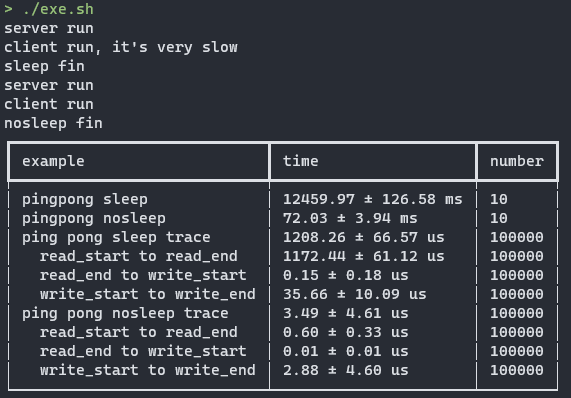

## Use

```bash
git clone https://github.com/zweix123/pingpong.git
cd pingpong
mkdir build && cd build
cmake ..
make -j`nproc`
cd ..
./exe.sh
```

脚本`profiling.py`需要Python3.10以上，同时需要一些依赖库，缺啥补啥即可。

我的机器上的结果  

